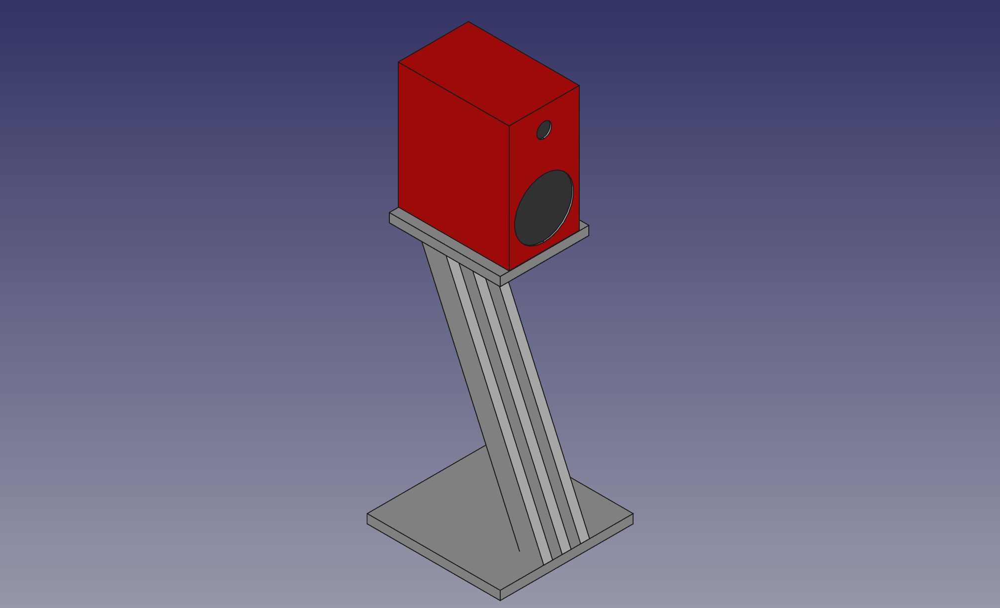
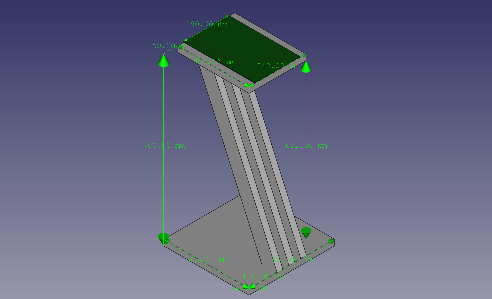

Speaker Stand
=============

**A speaker stand for my Bowers & Wilkins 606 Speakers**

Speaker Specs
-------------

| Measure | Value   |
|---------|---------|
| Width   | 190mm   |
| Length  | 300mm   |
| Height  | 345mm   |
| Weight  | 6.75 kg |

Material
----

The whole construction (top- & buttom- plates and the three stands) are made of 24mm solid wood panels. 

Draft
-----

Measures
--------

