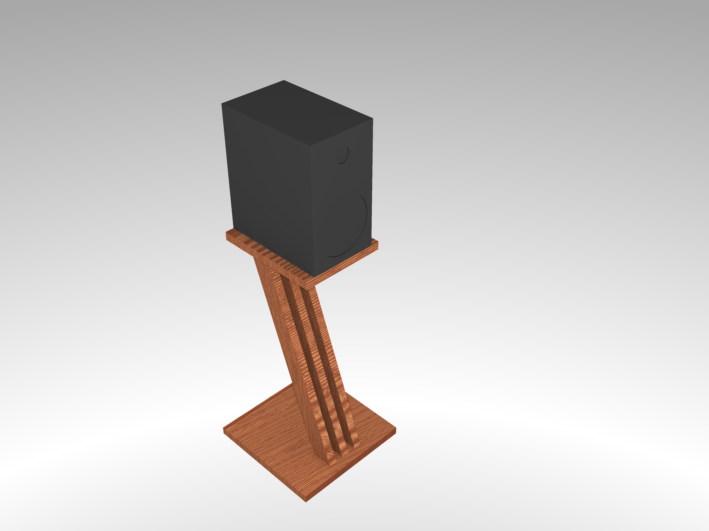
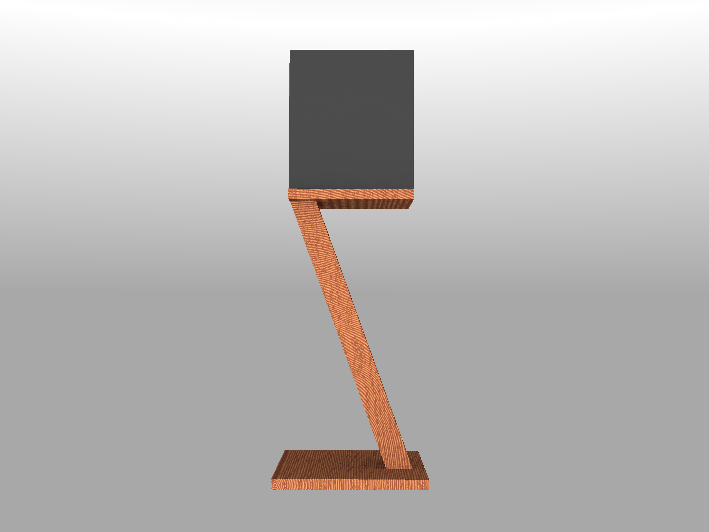
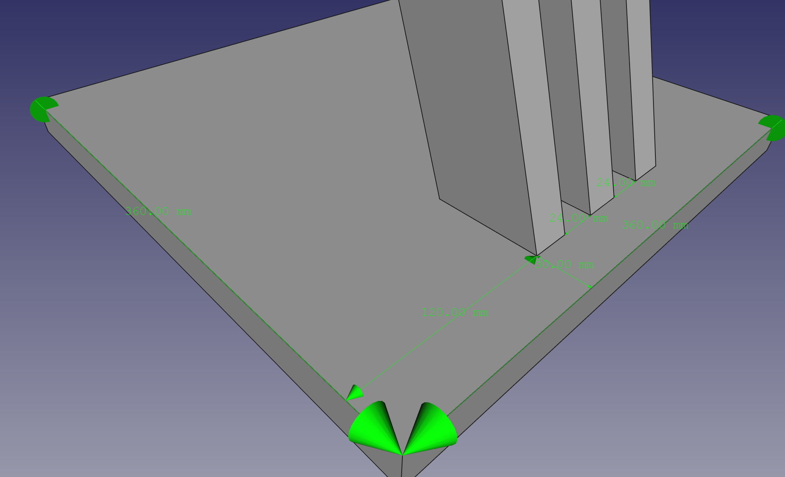
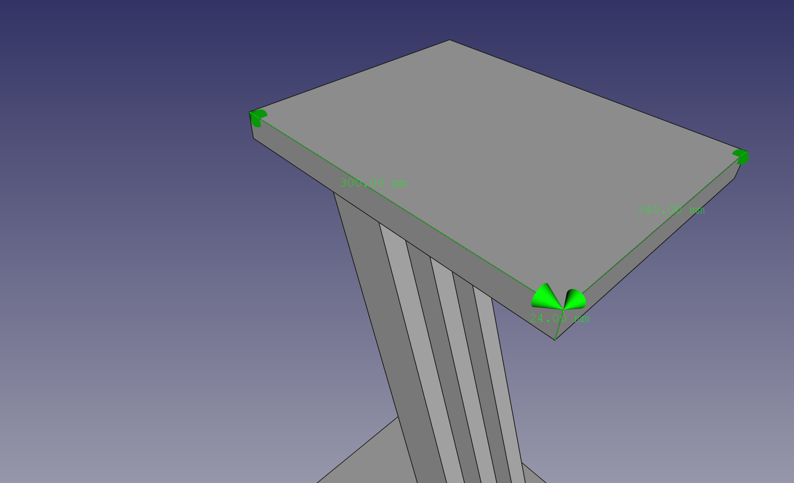
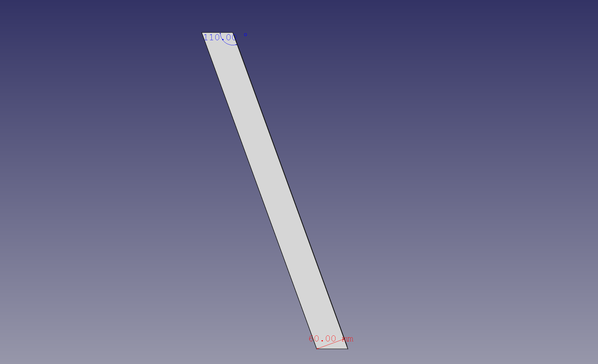
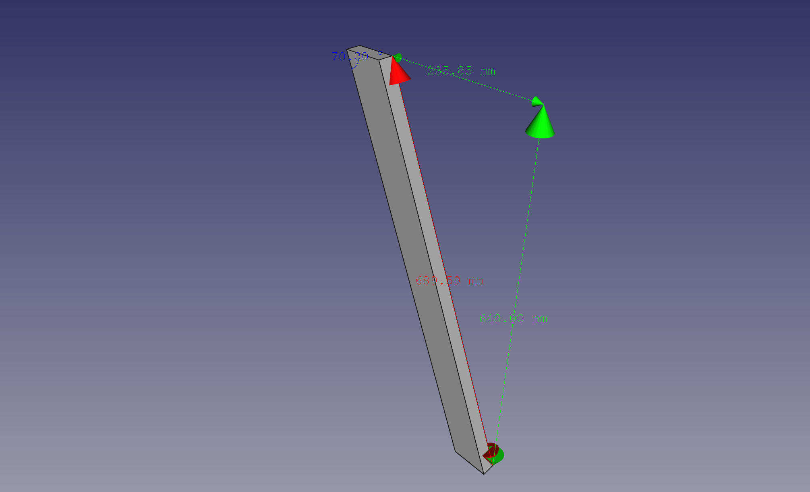

Speaker Stand
=============

**A speaker stand for my Bowers & Wilkins 606 Speakers**

This repository contains plans for my recent "I want to build my own speaker stands" project. This is about woodworking 
and has nothing to do with programming or it ;)




Speaker Specs
-------------

The construction should carry one of my 
[Bowers & Wilkins 606](https://www.bowerswilkins.com/net/home-audio/600-series-anniversary/606) speakers, which have the following measures:

| Measure | Value   |
|---------|---------|
| Width   | 190mm   |
| Length  | 300mm   |
| Height  | 345mm   |
| Weight  | 6.75 kg |

Material
----

The whole construction (top- & buttom- plates and the three stands) are made of 24mm solid wood panels. 

**TBD: More information after evaluation...**

Build
--------

### Bottom and Top Panels

The bottom plate is a 360 * 360 mm panel. The 3 stands are mounted on the bottom plate in center and have 24mm space in 
between:




The top plate is a 300 * 240 mm panel with an offset of x + 30mm and y + 60mm to hold it in center. 



### Stands

The three stands and equal sized bars with 600 mm width and 24mm thick. On top and bottom, they have 70' / 120' angles. 



Because degrees and millimeters don't always play together nicely, the length is not precise. The height of the stand, 
when mounted (including angle) is 648 mm.



Drawings & CAD
--------------

I use [FreeCAD](https://www.freecadweb.org/) for drawing. You can find the complete freecad project at `v3_3.FCStd`. 
There is also an exported STL mesh (`v3_3.stl`) if you prefer. Feel free to ask me about other formats.

### POV-Ray

THe 3D renders are built using povray:
 
```shell script
povray -H3000 -W4000 +FN +Ov3_3-overview.png v3_3.pov
```
 
The attached `v3_3.pov` is basically an export from FreeCAD with some look and feel enhancement. It uses included wood 
textures and some light and camera settings I often find appealing:

```c++
#version 3.6;

#include "colors.inc"
#include "metals.inc"
#include "woods.inc"
#include "rad_def.inc"

#declare T_wood = texture {
    T_Wood1
    scale 100.0
    translate x*8
    translate y*10
}

// Standard finish
#declare StdFinish = finish { crand 0.01 diffuse 0.8 };

// declares position and view direction

// overview
#declare cam_location =  <1530.28,1864.88,-983.709>;
#declare cam_look_at  = <187.26,521.852,359.314>;
#declare cam_sky      = <-0.408248,0.816497,0.408248>;
#declare cam_angle    = 45;

// side view
//#declare cam_location =  <196.548,449.177,-1965.72>;
//#declare cam_look_at  = <187.259,521.851,359.314>;
//#declare cam_sky      = <-0.00274216,0.999508,-0.0312531>;
//#declare cam_angle    = 45;

global_settings {
    radiosity {
        Rad_Settings(Radiosity_Normal,off,off)
    }
}

#default {finish{ambient 0}}

sky_sphere {
    pigment {
        gradient y
        color_map {
            [0.0  color LightGray]
            [0.3  color White]
            [0.7  color LightGray]
        }
    }
}

camera {
  location  cam_location
  look_at   cam_look_at
  sky       cam_sky
  angle     cam_angle
  right x*800/600
}

//default light
light_source {
    cam_location
    color White
    area_light <100, 0, 0>, <0, 0, 100>, 10, 10
    adaptive 1
    jitter
}
```